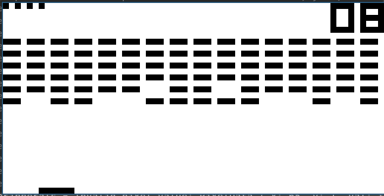
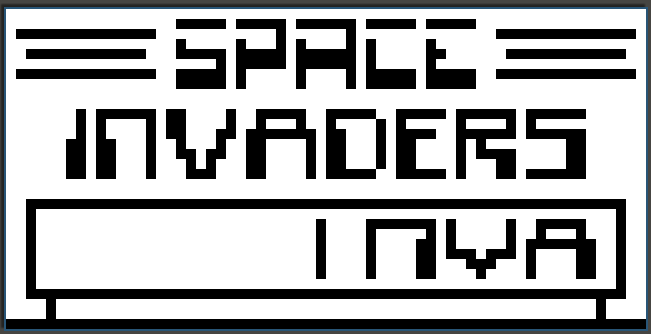

# Chip-8 Emulator in Rust


This project contains a Chip-8 Emulator written entirely in Rust. The goal of the project is to have an isolated Chip-8 Emulator that can easily integrate with various frontends and keyboard input events. There is an additional goal to write the emulator in such a way that uses all of the safe guarantees that Rust provides.

The project is currently a work in progress, and a few instructions are waiting to be implemented. Major things that are waiting to be completed are listed below.

Image of TicTac being played:


Image of Brix being played:



Image of Space Invaders intro:



Image of Space Invaders being played:


## Usage

To use simply run:

```bash
$ cargo run --release -- $ROM_NAME
```

## Completed
- Chip-8 memory pattern
- Opcode interpretation
- Running instructions
- Keyboard input and emulation
- Emulate display and collision detection
- Display data using sdl2
- Logging

## TODO
- Rework the error system
- Add unit tests
- Add integration tests

